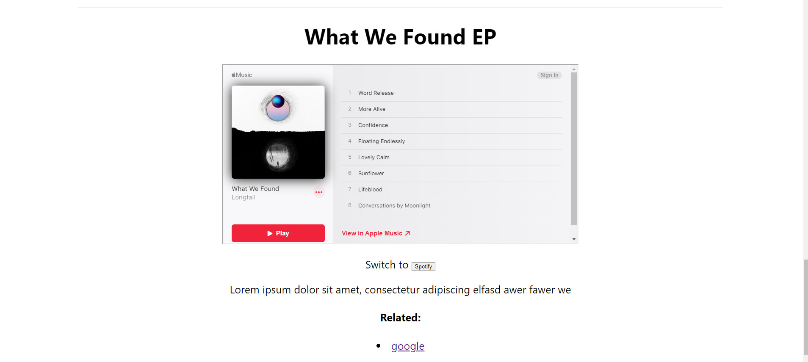
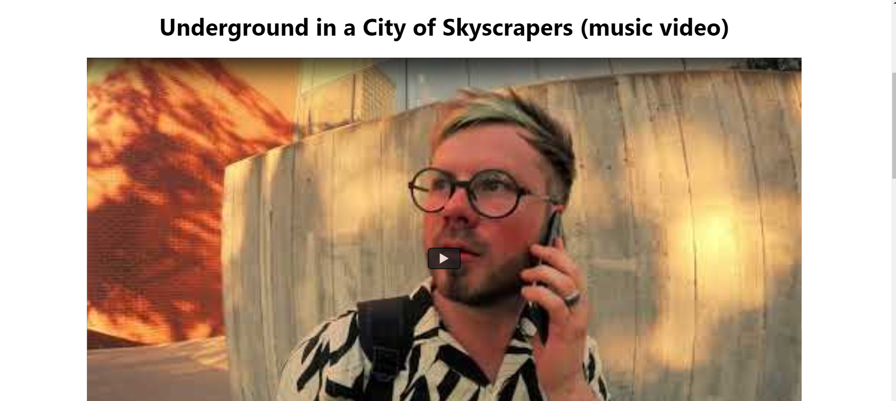
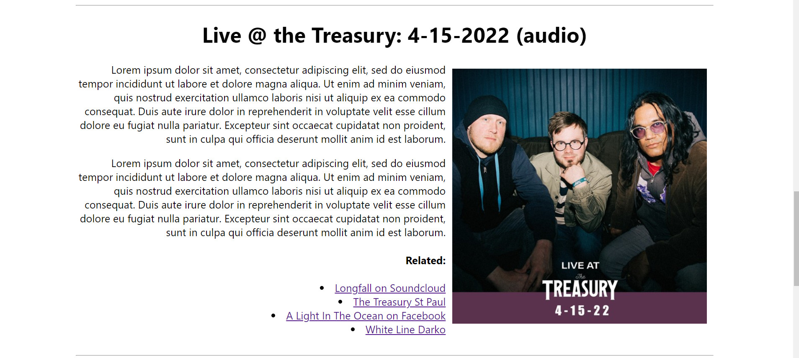

# Sleek Feed

create-react-app with Redux Toolkit for creating a site with 3 types of posts:

- music: allows for toggling between Apple Music and Spotify embedded players. Preferred player held in app state and applied throughout



- video: embeds a youtube link



- article: image with text. Articles automatically cycle alignment left/right based on index for variety



- adaptable layout for desktop or mobile/unusual aspect ratios


Note: don't 4get to ```npm install @reduxjs/toolkit``` as well as ```npm install```

Latest update: 11-1-2022:
---

- individual posts (URL/post/id) where id is currently the index of t a post in the array of posts
- abstracted related links to its own component
- home button componet that leads to root url (vanilla JS)


next steps:

- update post data to include tags array, date, id (to be used instead of index)

- filter by post type, tags
- pagination
- order by post date/id
