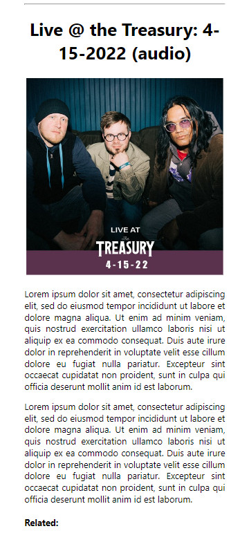

# Sleek Feed

create-react-app with Redux Toolkit for creating a site with 3 types of posts:

- music: allows for toggling between Apple Music and Spotify embedded players. Preferred player held in app state and applied throughout


- video: embeds a youtube link


- article: image with text. Articles automatically cycle alignment left/right based on index for variety


- adaptable layout for desktop or mobile/unusual aspect ratios


Note: don't 4get to ```npm install @reduxjs/toolkit``` as well as ```npm install```
